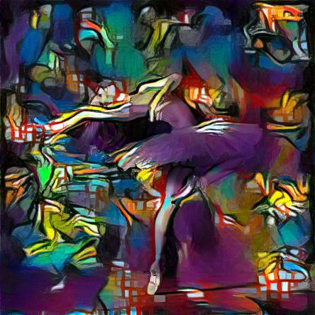

# Purpose 

This project is an executable container for Neural Style Transfer. At a high level, you supply content and style images as inputs, and the application will mix the style and content to produce a new image that is as faithful as possible to the style in the style image and the content in the content image.

Content Image


Style Image


Output Image



# Docker Hub

[Image](https://hub.docker.com/r/oneoffcoder/dl-transfer)

# Usage

To use the container, type in the following. Note that the `-s` flag specifies the style image and `-c` specifies the content image. By default, an `image/output.jpg` file be created. To control the output image, specify `-o` (e.g. `-o image/final.jpg`).

```bash
docker run -it \
    -v `pwd`/image:/app/image \
    --gpus=all \
    --shm-size=5g \
    oneoffcoder/dl-transfer -s image/picasso-01.jpg -c image/dancing.jpg

docker run -it \
    -v `pwd`/image:/app/image \
    --gpus=all \
    --shm-size=5g \
    dl-transfer:local -s image/picasso-01.jpg -c image/dancing.jpg

docker run -it \
    -v `pwd`/image:/app/image \
    --gpus=all \
    --shm-size=5g \
    dl-transfer:local -s image/picasso.jpg -c image/dancing.jpg -o image/final.jpg
```

# Citation

```
@misc{oneoffcoder_dl_transfer_2019, 
title={An executable docker container with Neural Style Transfer}, 
url={https://github.com/oneoffcoder/docker-containers/tree/master/dl-transfer}, 
journal={GitHub},
author={One-Off Coder}, 
year={2020}, 
month={Jan}}
```